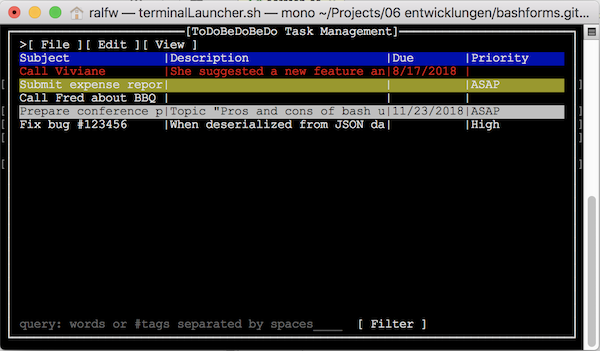
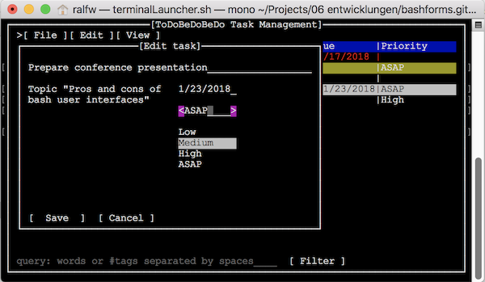
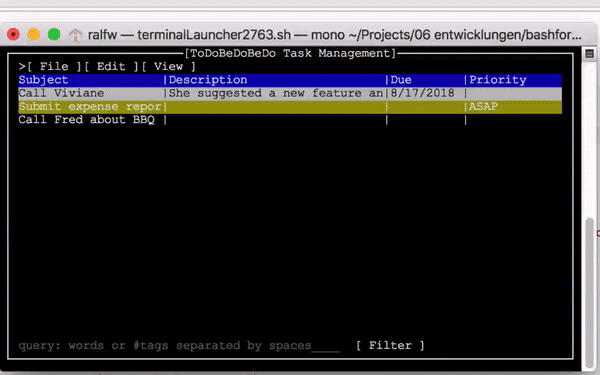
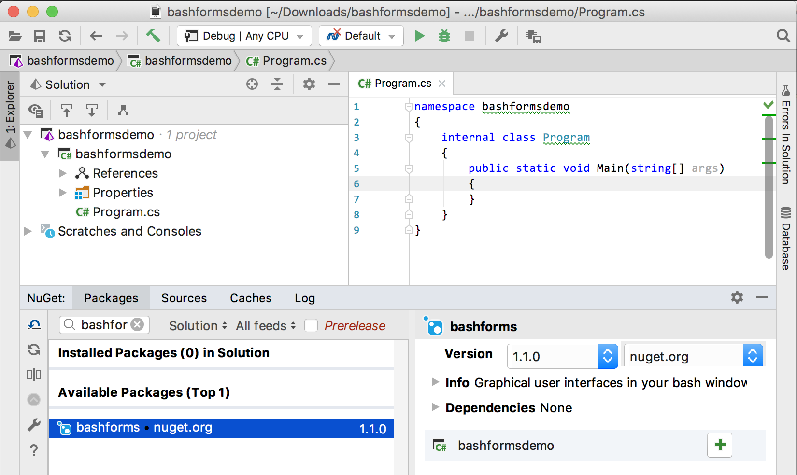
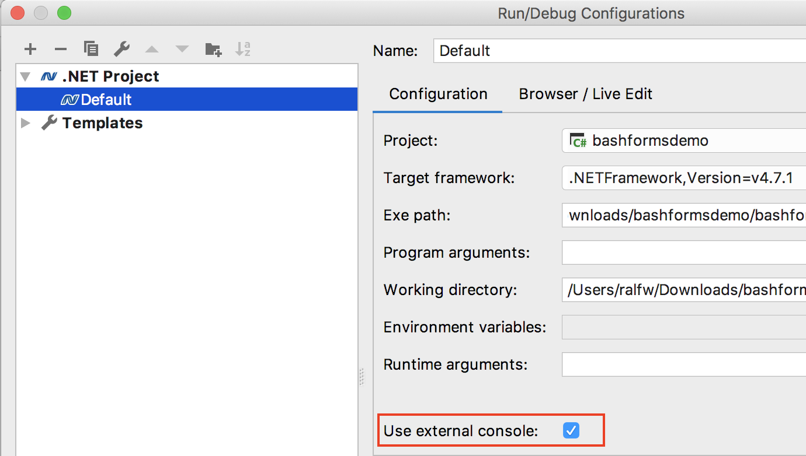
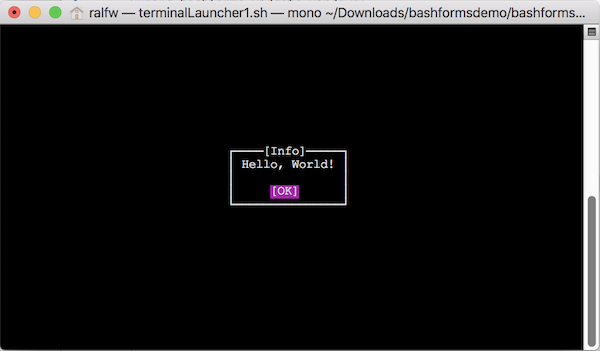
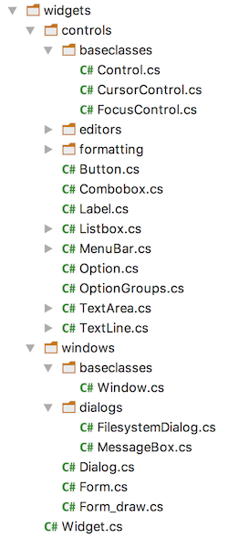
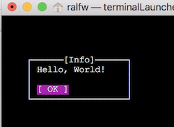

# bashforms - A text based GUI framework for .NET/Mono

You want more than a CLI/console user interface where you have to parse the command line and/or interact with the user through tedious sequences of `Console.WriteLine()`/`Console.ReadLine()`? But you cannot or do not want to create a full blown WinForms/WPF or HTML/JS user interface? Then bashforms is for you!

With bashforms the "graphical" user interfaces of the 1990s are back. You get dialogs and text editors and checkboxes and listboxes and menus... all in a bash window (or a terminal or console window or whatever you call it):





Widgets - that's what text editors, menus etc. are called - can be layed out in two dimensions. Windows - forms, dialogs - are stacked on top of each other. The above images show examples for both.

Check out the following animation to get an impression of how you navigate such a text based GUI (tbGUI). The full video can be found on [Youtube](https://youtu.be/RwkCy-YrVJQ).

[]()

If you like what you see, here's how you can use it for yourself. It's easy even if your experience with GUI frameworks like WinForms/WPF is limited.

## Installation
Create a Console Project in Visual Studio or Rider and add the bashforms NuGet package:



A single assembly will get added to your project: `bashforms.dll`.

## Hello, World!
Check if bashforms is working correctly by firing up a messagebox like this:

```
using bashforms.widgets.windows;

namespace bashformsdemo
{
    internal class Program
    {
        public static void Main(string[] args) {
            MessageBox.ShowInfo("Hello, World!");
        }
    }
}
```

Be sure to run the program in a bash of its own! If you're using Rider you need to tweak a configuration property:



You'll be rewarded with a beautiful tbGUI like this:



Click, no, press the OK-button by hitting `ENTER` or the spacebar. Even though this is looking somewhat like a real GUI it's not. No mouse support, just keyboard interaction.

## Using bashforms
### The Widget Hierarchy
What you see and interact with in bashforms are *widgets*: a window like the message box above is a widget like the button you press or the text displayed.

All widgets derive directly or indirectly from the class `Widget{}`.

All widgets are located under the namespace `bashforms.widgets` like this:



(Folder names are mapped to namespaces.)

Some widgets are not intended for immediate consumption in tbGUIs. They are base classes for interactive widgets; you find them in folders called `baseclasses`:

* `Widget{}`: the mother of all widgets defines just a couple of common traits for all widgets.
* `Window{}`: the mother of all *windows*, i.e. rectangular areas on screen to be containers for *controls*.
* `Control{}`: the mother of all widgets to be displayed inside a window.
* `FocusControl{}`: a control which can receive input from the user, e.g. `Listbox{}`or `TextLine{}`. In each window there can be several focus controls of which only one has the focus at any given time.
* `CursorControl{}`: a control which shows a cursor while it has the focus, e.g. `TextLine{}`.

User interfaces are created by adding control widgets derived from these base classes to window widgets. As an example a replica of the above message box:

```
using bashforms;
using bashforms.widgets.controls;
using bashforms.widgets.windows;
...
var info = new Form(4,4,20,5){Title = "Info"};
info.AddChild(new Label(2,1,"Hello, World!"));
info.AddChild(new Button(2,3, 6, "OK") {
    OnPressed = (s,e) => {...}
});
```



All controls are positioned explicity on their parent/host windows relative to their left/top corner. Windows are positioned on the console window area; windows don't have parents.

#### Widget Reference
##### Windows
* `Form{}`: A window with a border and a title.
* `Dialog<T>{}`: A form which returns a result of type `T` in its property `Result`.
* `MessageBox{}`: A dialog to display a message and let the user select from up to three options.
* `FilesystemDialog{}`: A dialog to let the user select a file or directory.

##### Controls
* `Button{}`: A button to press.
* `Combobox{}`: The user can enter a text line or select it from a drop-down list.
* `Label{}`: Some text to just be displayed without any interaction.
* `Listbox{}`: A list of items to scroll through. One or several can be selected. Items can be displayed with multiple columns.
* `MenuBar{}`: A menu to be displayed at the top of a window. It can be hierarchical, but will always displayed in a single line.
* `Option{}`: An option let's the user select it in single choice (radio button) or multiple-choice (check box) manner. Use an `OptionGroup{}` to connect several options for single choice.
* `TextArea{}`: Multi-line text entry.
* `TextLine{}`: Single-line text entry.

### The Engine
Windows are displayed using the bashforms engine. This is done most easily by using the static class `BashForms{}`.

Message boxes take care of that for themselves as shown in hello-world example. But for all other windows a `BashForms.Open()` must be issued, e.g.

```
BashForms.Open(info);
```

A single call to `Open()` will start an instance of the bashforms engine and put the window passed in on the window stack.

Starting the engine means the *keyboard loop* is started; this causes the first `BashForms.Open()` to "freeze" the application. Control flow will be stuck in it until the keyboard loop is ended.

 bashforms then sits and waits for the next key to be pressed and will deliver it to the topmost window on its stack for processing. After that it will redisplay all windows on the stack - and go back to waiting.

To close a window it needs to be popped off the window stack by calling `Close()`, e.g.

```
info.AddChild(new Button(2,3, 6, "OK") {
    OnPressed = (s,e) => BashForms.Close()
});
```

Only the topmost window can be closed at any time. Windows are strictly layered on top of each other:

```
bsp für stack
```

Once the window stack is empty the keyboard loop is terminated and the first `BashForms.Open()` call returns.


