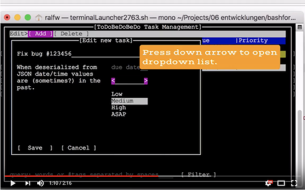

# bashforms - A text based GUI framework for .NET/Mono

You want more than a CLI/console user interface where you have to parse the command line and/or interact with the user through tedious sequences of `Console.WriteLine()`/`Console.ReadLine()`? But you cannot or do not want to create a full blown WinForms/WPF or HTML/JS user interface? Then bashforms is for you!

With bashforms the "graphical" user interfaces of the 1990s are back. You get dialogs and text editors and checkboxes and listboxes and menus... all in a bash window (or a terminal or console window or whatever you call it):


Widgets - that's what text editors, menus etc. are called - can be layed out in two dimensions. Windows - forms, dialogs - are stacked on top of each other. The above images show examples for both.

Check out the following video to get an impression of how you navigate such a text based GUI (tbGUI):

[](https://youtu.be/RwkCy-YrVJQ)

If you like what you see, here's how you can use it for yourself. It's easy even if your experience with GUI frameworks like WinForms/WPF is limited.

## Installation
Create a Console Project in Visual Studio or Rider and add the bashforms NuGet package:


A single assembly will get added to your project: `bashforms.dll`.

## Hello, World!
Check if bashforms is working correctly by firing up a messagebox like this:

```
using bashforms.widgets.windows;

namespace bashformsdemo
{
    internal class Program
    {
        public static void Main(string[] args) {
            MessageBox.ShowInfo("Hello, World!");
        }
    }
}
```

Be sure to run the program in a bash of its own! If you're using Rider you need to tweak a configuration property:


You'll be rewarded with a beautiful tbGUI like this:


Click, no, press the OK-button by hitting `ENTER` or the spacebar. Even though this is looking somewhat like a real GUI it's not. No mouse support, just keyboard interaction.


